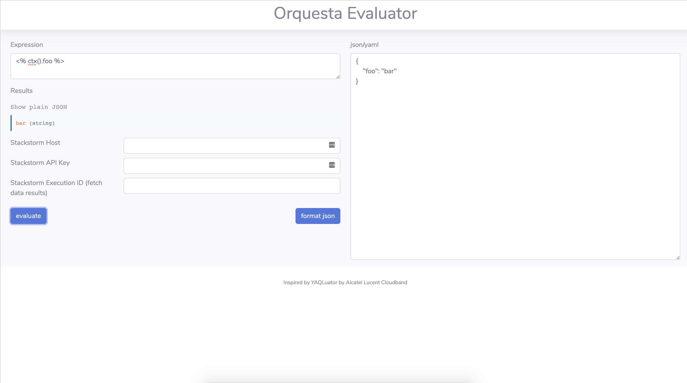
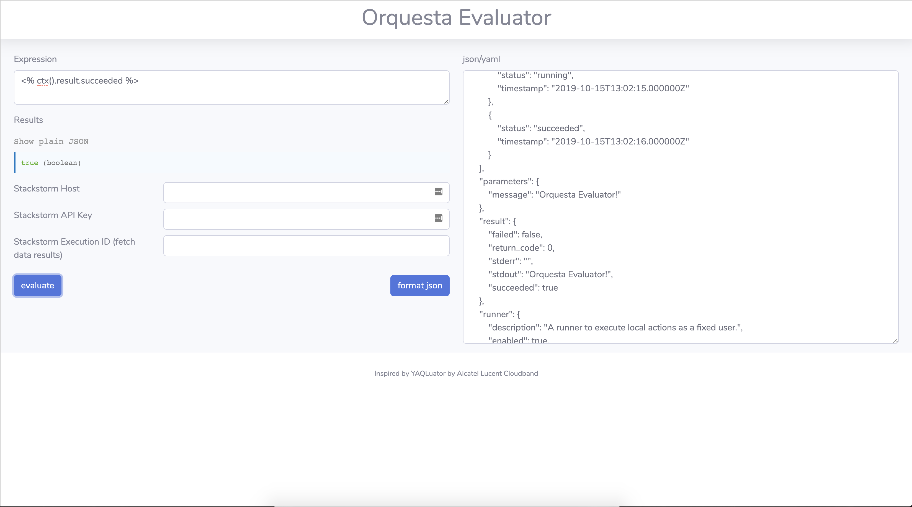
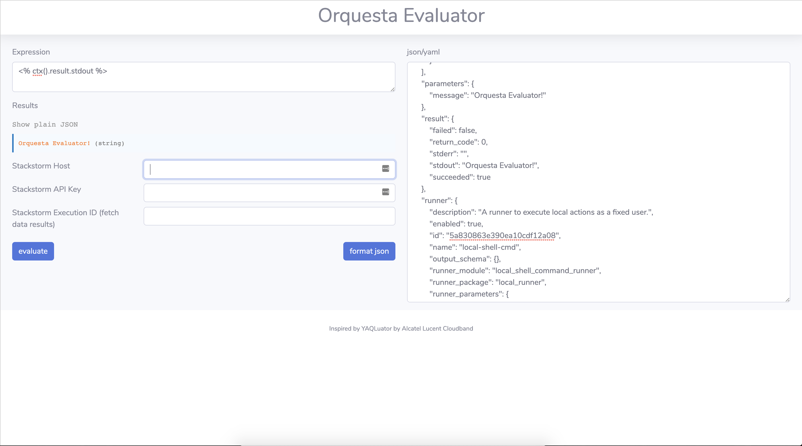

# Orquesta Evaluator
This application will take yaql/jinja expressions and evaluate them against json/yaml text.

## Features
* This application will accept either yaml or json as the text input.
* Text input can be beautified for readability
* A stackstorm host/api key can be provided along with an execution id to pull the input text directly from stackstorm

## Requirements
* python 3.6+

## Getting Started
* Install requirements `pip install -r requirements.txt`
* Start Flask server `python3 app.py`
* Navigate to the application page `http://0.0.0.0:5000/`

## Examples
Here are some screenshot examples.

Inline-style: 

## Credits
This project is heavily inspired by https://github.com/ALU-CloudBand/yaqluator - and in fact a bit of code was reused.